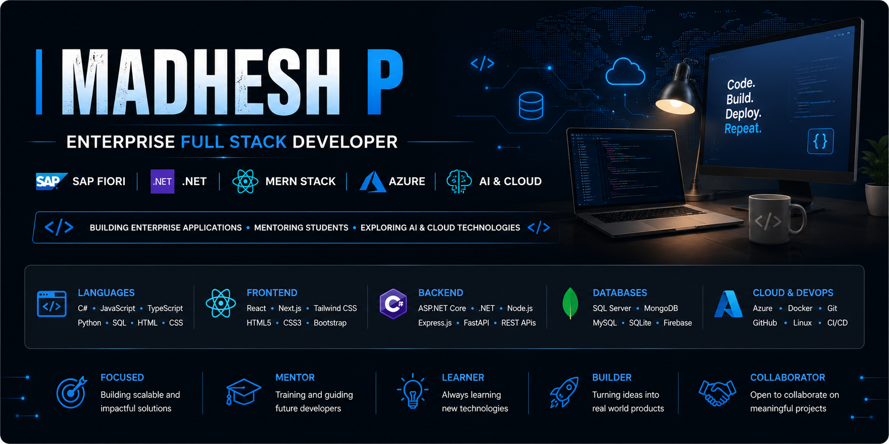

# 👋 Hi, I'm Madhesh P

### Enterprise Full Stack Developer • SAP Fiori Developer • .NET Developer • AI & Cloud Enthusiast

Building scalable enterprise applications using **SAP**, **.NET**, **MERN**, and **Cloud Technologies**, while mentoring future developers through hands-on technical training.

---

# 🚀 About Me

- 💼 Enterprise Full Stack Developer
- 👨‍🏫 Technical Teaching Assistant & Corporate Trainer
- 🌐 SAP Fiori & SAP BTP Developer
- ⚙️ ASP.NET Core / C# Developer
- ⚛️ MERN Stack Developer
- ☁️ Microsoft Azure Enthusiast
- 🤖 AI & Automation Explorer
- 📚 Passionate about building enterprise software that solves real business problems

---

# 💻 Tech Stack

### Languages

### Frontend

### Backend

### Databases

### Cloud & DevOps

### SAP

`SAP Fiori` • `SAP UI5` • `SAP CAP` • `SAP BTP` • `Business Application Studio` • `OData V4`

---

# 🚀 Featured Projects

## 🤖 Skynet AI Presentation Generator

AI-powered PowerPoint Generator built using React, FastAPI, MongoDB, Python, Groq & NVIDIA NIM.

🔗 **Repository:** *(Add Link)*

---

## 🌐 Enterprise Applications

Scalable business applications built with:

- ASP.NET Core
- C#
- SQL Server
- Azure
- REST APIs

---

## 🌟 SAP Enterprise Solutions

Enterprise SAP applications using:

- SAP UI5
- SAP Fiori
- SAP CAP
- SAP BTP
- OData V4

---

## ⚛️ MERN Stack Applications

Modern web applications using MongoDB, Express.js, React and Node.js.

---

## 🌿 Tomato Disease Detection

IoT + Machine Learning solution using ESP32-CAM, TensorFlow and Google Cloud.

---

# 👨‍🏫 Professional Experience

### Technical Teaching Assistant

✔ Conduct Technical Training Sessions

✔ Mentor Students

✔ Review Projects

✔ Conduct Code Reviews

✔ Help Students Become Industry Ready

✔ Deliver Hands-on Workshops

---

# 🌱 Current Focus

- SAP BTP
- SAP CAP
- Microsoft Azure
- ASP.NET Core
- AI Agents
- Cloud Native Applications
- System Design
- Microservices

---

# 📊 GitHub Analytics

---

# 🏆 Achievements

🏅 Technical Teaching Assistant

🏅 Enterprise Application Developer

🏅 SAP Fiori Developer

🏅 Best Outgoing Project Award

🏅 Paper Presentation Winner

🏅 AI & IoT Project Developer

---

# 🤝 Let's Connect

---

### 💭 Philosophy

> **"Code. Build. Teach. Inspire. Repeat."**

⭐ *Thanks for visiting my profile! Feel free to explore my repositories and connect with me.*

